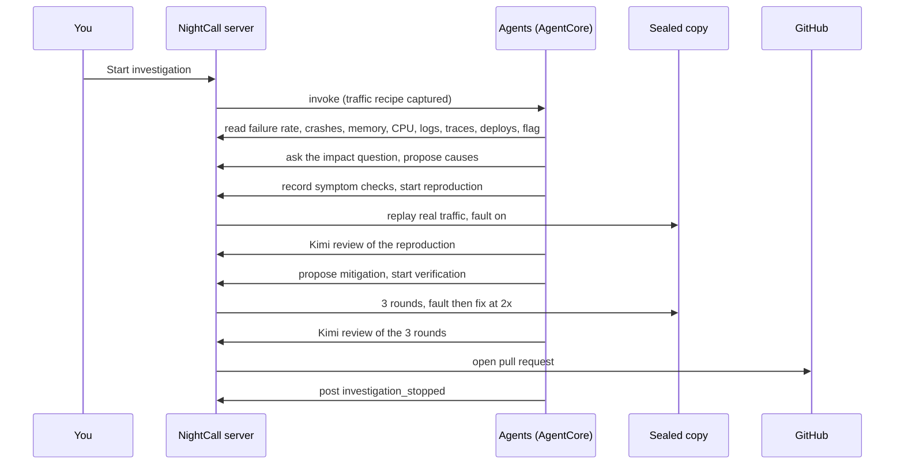
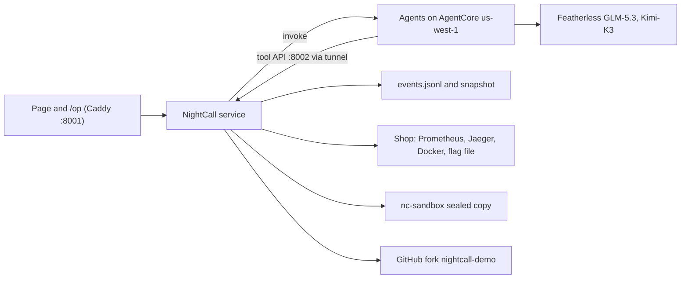

# CLAUDE.md

This file provides guidance to Claude Code (claude.ai/code) when working with code in this repository.

## What this is

NightCall investigates a production incident in the Astronomy Shop demo (OpenTelemetry Demo), proves a fix in a sealed copy of the shop, and opens a one-line pull request, all shown on a live, evidence-backed incident page. The flagship incident is the recommendation service running out of memory when the `recommendationCacheFailure` flag is on.

Current docs: `night-call/README.md`, `night-call/ARCHITECTURE.md`, `night-call/docs/SUBMISSION-DRAFT.md`, `night-call/docs/RECORDING-CHECKLIST.md`, `night-call/docs/BUILDER-AWS-POST.md`. Product intent: `night-call/docs/design/NIGHTCALL-DESIGN-BRIEF.md`. History only: `night-call/PLAN.md`, `night-call/BRIEF.md` and `night-call/docs/phases/` (they still say AgentCore runs in eu-central-1; it runs in us-west-1). Trust the code over them.

## Repository layout

- `night-call/` NestJS service (TypeScript, CommonJS). Modules registered in `src/app.module.ts`:
  - `investigation/` event log, reducers, `snapshot.json`, run report, headline, admission and proof rules, live stream
  - `incidents/` `POST /alerts`, manual start, incident store; calls `runtime/runtime-invoker.ts`
  - `recorder/` rolling memory, CPU and Docker events for production (30 minutes, in memory)
  - `tool-api/` role-token routes the agents call; `production/` holds the readers they use
  - `experiments/` contract, experiment and verification jobs, sandbox owner and worker process, live progress, mitigation diff, deadline watch
  - `publication/` opens the pull request after an approved 3 of 3 run, plus a retry route
  - `public-api/` read-only incidents, events, series, markers, evidence, live progress; `operator-api/` `/op/api`
- `night-call/src/sandbox-copy/` builds and runs the sealed copy (compose project `nc-sandbox`).
- Legacy, unregistered: `src/agents`, `src/evidence`, `src/pipeline`, `src/probes`, `src/report`, `src/sandbox` (only `sandbox-copy/sandbox-flag.ts` still imports it). Don't build on them.
- `night-call/agent/` separate ESM package: the Strands agents. Runs on AWS AgentCore, with the same image as a box container fallback. `agent/scripts/` holds the AgentCore deploy (`npm run deploy`).
- `night-call/web/` Vite + React 18 incident page, built into the Caddy `status` image; `night-call/status/` Caddyfile and Dockerfile.
- `astronomy-shop-overlay/` compose overlay, Prometheus rules, Alertmanager and collector extras added to the shop without editing upstream files.

## Commands

Service (`night-call/`): `npm run build`, `npm run lint`, `npm test` (Jest, about 66 specs). One file: `npx jest src/investigation/investigation-stop.spec.ts`; by name: `npx jest -t "<part of the test name>"`.

Agents (`night-call/agent/`): `npm run build`, `npm run typecheck`, `npm run lint`, `npm test` (node test runner, `src/*.test.ts`). One file: `node --import tsx --test src/review-rules.test.ts`. Deploy to AgentCore from the Mac: `npm run deploy` (profile `NIGHT_CALL_AWS_PROFILE`, region `NIGHT_CALL_AGENTCORE_REGION`, default us-west-1; Docker Desktop running; image tagged with the commit).

Web (`night-call/web/`): `npm run build`, `npm run lint`, `npm run typecheck` (no unit tests; check in Chrome).

## How a run works

1. An incident opens from `POST /op/api/investigations` (manual, labelled "Manually triggered") or `POST /alerts`. Opening writes `alert_received`, captures a traffic recipe from traces, warms the sandbox, and invokes the agents. Alerts only invoke agents when `NIGHT_CALL_INVOKE_AGENTS_ON_ALERT=true` (off on the box).
2. `runtime/runtime-invoker.ts`: an http URL in `NIGHT_CALL_AGENT_RUNTIME_ARN` targets the `nightcall-agents` container; an ARN targets AgentCore.
3. `agent/src/investigation.ts` runs a fixed order in code: `askImpact`, `readEvidence`, `findCauses`, then `proveAndDecide` (`proof-steps.ts`: `recordContract`, `reproduce`, `decideUrgency`, optional `extraExperiment`, `proposeMitigation`, `verifyMitigation`), `waitForPublication` (until minute 24), the brief, then `postStopped`. Every step is skipped and recorded, never silently dropped, when the server refuses it or time runs out.
4. Models (Featherless, OpenAI-compatible, per role `provider:modelId`): lead and investigator GLM-5.3, lead fallback Kimi-K3, reviewer Kimi-K3 (`model-reviewer.ts`, guarded by `review-guard.ts`). `model.ts` wraps fetch with `message-role-stream.ts` and `message-end-stream.ts` to repair Featherless streams.
5. Every read is a server route under `/tool/incidents/:id/prod/*` that records `evidence_recorded` with exact source links. Proof routes: `contract`, `experiments`, `experiments/:id/evidence|review`, `jobs/:jobId`, `mitigations`, `verifications`, `verifications/:runId/review`.
6. Every change is an event in `state/incidents/<id>/events.jsonl`; `investigation/` rebuilds `snapshot.json` after each append and streams it. The page (`/incidents/:id`, `/op/incidents/:id`) shows the report, the live replay panel (`web/src/screens/live-run-panel.tsx`, fed by `/api/incidents/:id/experiments/:id/live` and `/cycles/:n/live`), proof sections and the pull request button.

## Rules the code enforces

- The event log is the single source of truth. Payloads are zod-validated per type; unknown fields are rejected, so a new field needs a contract change on both the service and agents.
- Roles come from the bearer token (`NIGHT_CALL_TOOL_TOKEN_LEAD`, `_INVESTIGATOR`, `_VERIFIER`), never the body. Each route and event type has a role allow list; service-only events (evidence, experiments, cycles, publication, finish) are never accepted over HTTP. Operator writes need the `X-NightCall-Operator` header that only Caddy adds on `/op/api/*`.
- One active real incident per service; test incidents (`nightcall_test="true"`, `illustrative: true`) never block and open no pull request unless the alert also has `nightcall_publish="true"`.
- Honest reporting: numbers quote readings exactly (missing is "not measured"), shoppers' frontend error share comes before the backend span, a cause needs a mechanism and cited evidence, counts and effects can't be cited against a cause, "supported" needs two independent readings, and nothing says reproduced, verified or fixed without the matching proof events.
- Proof: symptom checks are recorded before any experiment and never change; one job at a time; reproduction replays the incident's real traffic at speed 1; mitigation and verification rounds replay at speed 2 until at least 200 requests; the reviewer may reject a passing run only by quoting an observed value and can never approve a failed check or a null observation; verified needs 3 of 3 on the same contract and mitigation; the pull request opens only after approval and inside the budget (`NIGHT_CALL_BUDGET_MINUTES`, default 30, enforced by the deadline watch).
- Sandbox writes go only to `nc-sandbox`, on an internal network with no ports, with memory limits verified against production. Production identity (flag hash, image, source checksum) is compared before and after every round.

## Coding rules (from BRIEF.md, enforced by lint)

Zero comments. At most 20 lines per function, 2 parameters, 2 indent levels, 5 members per class, 100 lines per file. Plain names a non-engineer can read, predicates in positive form. No em dashes anywhere, including docs. One thing per file. The vendored design system in `web/src/design-system/` is exempt.

## Settings that change behaviour

| Setting | Default | Effect |
|---|---|---|
| `NIGHT_CALL_AGENT_RUNTIME_ARN` | empty | http URL: box container; ARN: AgentCore |
| `NIGHT_CALL_BEDROCK_REGION` | eu-central-1 | must be `us-west-1` when the ARN is the AgentCore runtime |
| `NIGHT_CALL_BUDGET_MINUTES` | 30 | incident deadline, deadline watch, worker limit |
| `NIGHT_CALL_INVOKE_AGENTS_ON_ALERT` | false | only `true` lets alarms start agents |
| `NIGHT_CALL_<ROLE>_MODEL` | GLM-5.3, verifier Kimi-K3 | per role model, `provider:modelId` |
| `NIGHT_CALL_<ROLE>_REASONING` | high; verifier and lead fallback medium | `none` omits the parameter |
| `NIGHT_CALL_REVIEW_REASONING` | low | Kimi reviews (max 1200 tokens, 120 s, one retry) |
| `TOOL_API_URL` | none | the tunnel address the agents call |

## The box

Everything runs on the Hetzner box (`<box-host>`, x86_64) inside the shop's compose project `prod`.
- Repo clone `/root/code/NightCall` (symlink `/root/code/night-call`); the box builds only from merged `main`. Service settings live in `/root/code/night-call/.env` (backups `.env.bak-*`); it holds the AgentCore ARN, `us-west-1`, and the key of IAM user `nightcall-runtime-invoker` (invoke-only on the runtime). The old admin user `AWS-NightCall` is no longer used by night-call.
- Deploy one service from `/root/code/astronomy-shop` without touching the shop:
  `docker compose --env-file .env --env-file .env.override -p prod -f compose.yaml -f compose.full.yaml -f compose.observability.yaml -f compose.box-override.yaml -f compose.nightcall.yaml up -d --build --no-deps night-call` (or `status`). For a settings-only change use `--force-recreate` without `--build`.
- `nightcall-agents` (fallback) is a plain `docker run` container on network `opentelemetry-demo`; rebuild with `docker build -t nightcall-agents:x86 /root/code/night-call/agent` and recreate it from its own env with a temporary mode-600 file. AgentCore reads the same variables, so redeploy the runtime after agent changes.
- Crash control: `docker exec night-call node dist/scripts/set-shop-flag.js on|off`. Keep it on while preparing a recording; turn it off afterwards. `deploy-bad-config` commits the fault to the fork so the pull request diff is real.
- Incident state: Docker volume `prod_night-call-state`. The page is reached from the Mac through an SSH forward of ports 8001 (page) and 8080 (Grafana, Jaeger).

## Gotchas

- Restarting `night-call` interrupts any active incident and empties the recorder: a run started within 10 minutes reports 0 crashes and thin causes. Check `GET /api/incidents` first and warm up 10 minutes before a demo.
- The recommendation service's flag provider can go stale and ignore flag changes (flagd reports on, no "cache miss" log lines). Restarting recommendation fixes it, but that touches the live shop: ask Saif first.
- Featherless drops the stream `role` with `reasoning_effort` low, and Kimi can end a stream with no `finish_reason`; Strands then throws "Stream ended without completing a message". The stream wrappers in `model.ts` repair both; keep them.
- Kimi reviews at medium reasoning took up to 3 minutes; the review settings above keep them near 15 s. Reviewers may disagree on a weak cause, which is correct behaviour.
- Agents must read publication state from `GET /tool/incidents/:id/case`; `/api/*` is not reachable through the tool tunnel.
- Public address `https://nightcall.shipic.dev` runs through the box's existing named Cloudflare tunnel ("big", managed in the Cloudflare dashboard): paths `^/tool/` go to port 8002, everything else to port 8001, and `ssh-big.shipic.dev` stays on the same tunnel. `/op` is behind a Cloudflare Access app (owner email only); a new Access rule can take about a minute to enforce, so check `/op` returns 302 to the login before trusting it. `TOOL_API_URL` for both agents (AgentCore and the box container) is this address; changing it means recreating the box container and redeploying AgentCore.
- Jaeger keeps traces only in memory (about 20 minutes). A large query restarts it: read in pages of at most 500 with a bounded window. Prometheus span metrics arrive about every 60 s; use `[2m]` windows or wider.
- `docker events --since/--until` returns nothing on this box; the recorder keeps its own live subscription. `src/sandbox/flagd-file.ts` (still used by `sandbox-copy/sandbox-flag.ts`) must rewrite in place; a rename breaks the bind mount.
- Automatic Alertmanager alerts for `service=recommendation` are silenced (until 2026-09-15 05:22 UTC) so the manual flow isn't blocked.
- Subagents' permission checks may block production restarts (`docker compose ... --force-recreate night-call`); ask Saif to run those himself.
