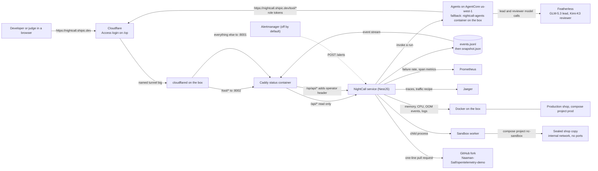
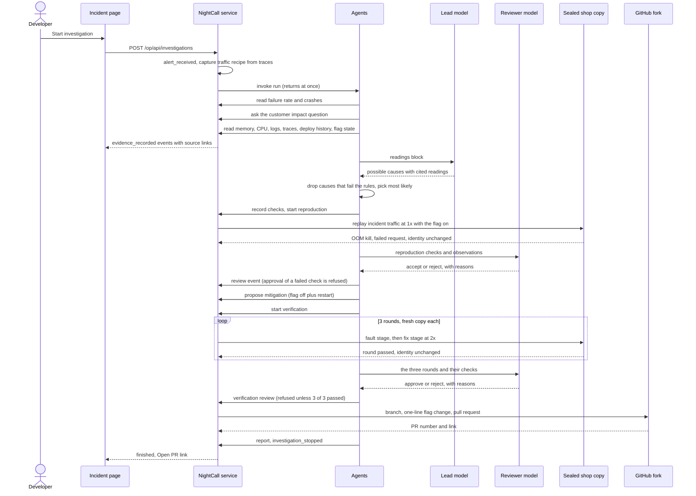

# Architecture

The rule: agents choose, code acts. Agents read through server routes and write through a small set of role-checked events. Every Docker write, every experiment, every check verdict, the 3 of 3 rule, the deadline and the pull request are plain code in the NightCall service. The reviewer model writes the reasons for accepting or rejecting, but code refuses any approval of a failed check or a missing observation.

## Components and who talks to whom

| Part | Where | What it owns |
|---|---|---|
| Caddy status container | `status/` | Serves the page on 8001, proxies `/api/*` and `/op/api/*` (adding the operator header), and exposes only `/tool/*` on 8002. Both ports bind to 127.0.0.1; the box's named Cloudflare tunnel publishes them as `https://nightcall.shipic.dev` (`/tool/*` to 8002, everything else to 8001). |
| NightCall service | `src/` | Incident opening, the event log and snapshot, evidence readers, the tool API, experiments and verification, the deadline watch, publication. |
| Evidence readers | `src/production/`, `src/tool-api/` | Failure rate, memory, CPU, out-of-memory events, logs, traces, deploy history, live flag state, and the traffic recipe. Each records an `evidence_recorded` event with source links. |
| Recorder | `src/recorder/` | Memory and CPU for shop containers every 10 seconds, last 30 minutes kept, plus a live Docker events subscription. |
| Incident state | `src/investigation/` | `events.jsonl` per incident, zod-checked payloads, per-role allow lists, a reducer that rebuilds `snapshot.json` (including the report and headline) after each append, and the event stream. |
| Experiments | `src/experiments/` | Check catalogue, reproduction and verification jobs (one at a time), the sandbox worker child process, check evaluation, production identity before and after, the 30-minute deadline. |
| Sandbox copy | `src/sandbox-copy/` | Renders a sealed compose copy (`nc-sandbox`), checks isolation rules, replays traffic, observes memory, CPU and restarts, cleans up. |
| Publication | `src/publication/` | Refuses without an approved 3 of 3 run, builds the one-line flag diff, opens the pull request on the `nightcall-demo` branch, retry on failure. |
| Agents | `agent/` | The fixed investigation order, lead model calls, cause rules, the question and urgency decision, reproduction, mitigation and verification steps, the Kimi-K3 reviews of the reproduction and the verification run (added 2026-09-14, first used in INC-019), and the final report. |
| Page | `web/` | Vite and React. Charts of what happened first, then the story: readings, question, possible causes, reproduction, fix, verification, pull request. |

## One run, from the button to the pull request

## Trust boundaries

- **Public page:** `https://nightcall.shipic.dev/incidents`, read only. `/alerts` answers 404.
- **Operator:** `https://nightcall.shipic.dev/op` is behind a Cloudflare Access login (owner email only). The operator header is added by Caddy on `/op/api/*` only; the service refuses operator writes without it.
- **Agents:** reach only `/tool/*` (`https://nightcall.shipic.dev/tool/*`, routed to port 8002). The token decides the role. Lead may write the brief, causes, the question, role status and the stop event; investigator may change cause status; verifier may write the two review events. Everything else is written by the service.
- **Sandbox:** Docker writes are refused unless the project is `nc-sandbox`. The copy runs on an internal network with no published ports, with memory limits checked against production.
- **Production:** read only. Flag hash, image and source checksum are compared before and after every reproduction and every verification round.

## Where the state lives

`state/incidents/<id>/` holds `events.jsonl` (the single source of truth), `snapshot.json` (rebuilt from events), the traffic recipe, the memory and CPU series kept from before the incident opened, and the live progress files for each experiment and round. Restarting the service marks any active incident as interrupted rather than pretending it continued.
