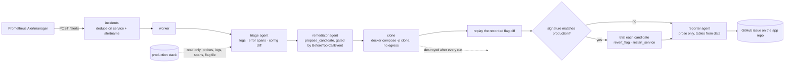

# Night Call

Most AI SRE tools wake you up with a guess. Night Call takes the page itself, rebuilds the failure inside a disposable copy of your stack, runs candidate fixes against that copy, and files a GitHub issue containing everything it actually proved. Production is read only by construction.

Built for the AWS Agents for Humans Hackathon, Professional Agents track, on the Strands Agents SDK with Amazon Bedrock.

## What it does

1. Prometheus Alertmanager posts an alert to the ingress. One incident per service and alertname, so a flapping alert does not become forty pages.
2. A triage agent reads container logs, error spans and the config diff since the last healthy snapshot, and returns a hypothesis.
3. Deterministic code brings up a full second copy of the stack, replays the recorded config diff into it, and compares the copy's failure signature with production's.
4. A remediator agent proposes candidate fixes from a fixed vocabulary of three actions.
5. Deterministic code applies each candidate inside the copy and probes before and after.
6. A reporter agent files a GitHub issue with the evidence: the diff replayed, both signatures, and each candidate with its verdict.
7. The copy is destroyed. Nothing survives the run except the issue.

## How the pieces fit



Agents decide. Code acts. No agent touches a container, a file or the network. Every mutating call takes a project name and is refused unless `projectAcceptsWrites` says it is the sandbox.

## What it will not do

- Mutate production. Every mutating call is bound to the sandbox project name. Production is a read only source of evidence.
- Open a pull request or apply a fix. Once the fix is proven, implementing it is the short part, and it belongs to a human.
- Reach the internet from the sandbox. The copy comes up with no external network.
- Invent a reproduction. Replay is code applying a recorded diff, with no model involvement.

There is no shell tool and there are no free form commands. A proposal outside the vocabulary is rejected by a Strands `BeforeToolCall` hook before it can reach the sandbox.

## The autonomy rule

The agent may only move a value back to something already observed while the service was healthy.

Reverting to a known good value is trialled automatically. A value the system has never been seen healthy at is written into the issue as a suggestion for a human and is never applied, not even inside the copy.

## Scope: the trigger is in the diff

In scope are faults whose cause is visible in a config or flag change and that come back in a cold copy: a bad config push, a crash loop from a bad environment variable, a flag flipped the wrong way, a wrong image tag pinned in the compose file.

Load shaped and state shaped faults are tier two. Queue backpressure under real traffic will not come back in a cold copy. Night Call diagnoses it, fails to reproduce it, and says so plainly in the issue rather than dressing a guess up as proof.

## Why forking, not cloning

Cloning starts the copy cold, which is why the scope line above exists: a cold copy carries the configuration that caused the failure but none of the state that shaped it. An environment fork would carry both. Checkpointing the running containers and restoring them into an isolated network would reproduce the queue depth, the cache contents and the connection pool that a cold start throws away, and tier two would collapse into tier one. That is the direction, not this weekend's build.

## Running it

```
cp .env.example .env
make install
make check
make overlay SHOP=/root/code/astronomy-shop
make prod-up SHOP=/root/code/astronomy-shop
```

Night Call runs as a container next to the shop. `make break-payment` flips the payment flag the way a careless release bot would; within a few minutes an issue appears on the application repository and on the status page at `http://localhost:8001`. `make heal-payment` puts the flag back.

Settings live in `.env`. The model id is pinned there after reading `aws bedrock list-inference-profiles` in the chosen region, never copied from memory.

## Repositories

- `night-call`: this repository. The agent and the pipeline. Apache 2.0.
- `astronomy-shop`: a fork of the OpenTelemetry Demo carrying the compose overlays and the Alertmanager configuration. Issues are filed there, so the artifact lands on the application's repository the way it would in real life.
